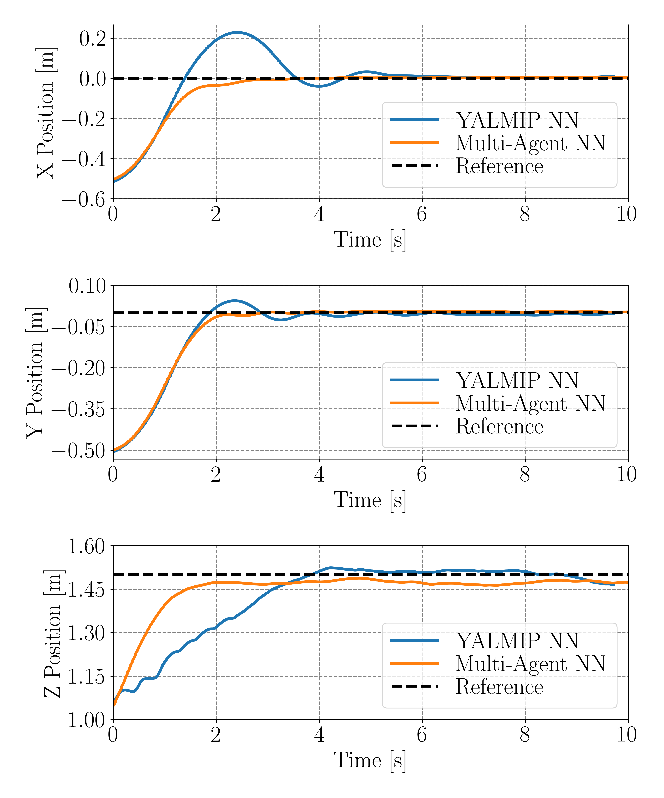

# Drone Example 

## Drone Simulation
Provide for reference. 
## 

    MATLAB/drone_simulation_random_point.m

* Simulate trained NN controllers with MATLAB given a fixed reference $[x,y,z]=[0,0,1.5]$.

## 
    NN_DRONE_trajectories.py

* Simulate trained NN controllers with Python given a fixed reference $[x,y,z]=[0,0,1.5]$.

## Hardware Experiments
The experimental results and data are saved in MATLAB folder.

## 

    MATLAB/Continue_NN_Controller.m
    MATLAB/Continue_LQR_Controller.m

* Controling the drone and given different control methods. (hardware is needed)

##
    MATLAB/dataplot_NN_LQR.py

* Plot state profile (show up in paper) from saved experimental data:

