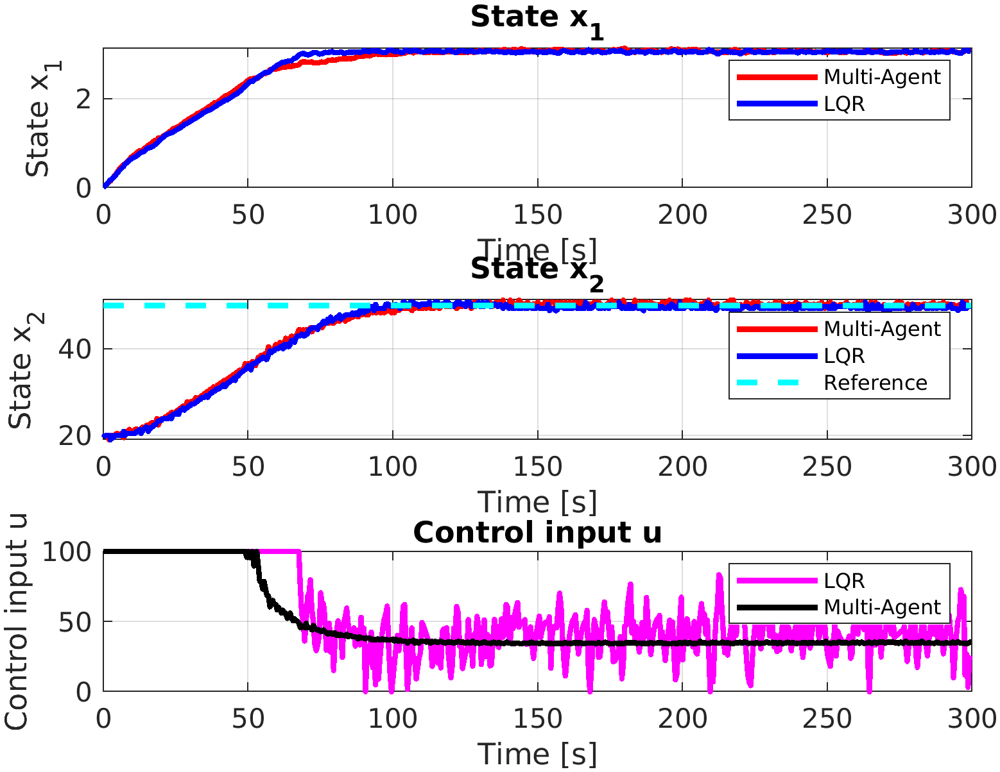

# Single Heater System

The single heater system discrete-time state-space representation is:

$$
\begin{align}
x(t+1) &= \begin{bmatrix}
0 & -0.0005 \\
1 & -0.0965
\end{bmatrix} x(t) +
\begin{bmatrix}
0.0004 \\
-0.00
\end{bmatrix} u(t), \\
y(t) &= \begin{bmatrix}
0 & 1
\end{bmatrix} x(t) + T_{amb.},
\end{align}
$$

where $T_{amb.}$ is ambient temperature.

If you want to compare your results with our heater system, this is a good demo.
## 
    heater_new_model_simulation

* Dynamic simulation with LQR control, Multi-Agent optimal control, and Neural Controller methods.

## Hardware Experiemnt:
## 

    heater_new_model_hardware.m

* The second section drow the paper figures:
(Need to load both .mat files.)

* The first second connects Arduino kit board, build transition with the heater system.

## Other Files
    heater_new_model_multi_agent_datacollection.m

* Used for data collection. 
* A little different from the method metioned in paper. This reference code shows data is collected every iterations given one reference $T_{desire}$.
##
    NN_heater_trajectories_simulation.py

* Verify the convergence for different trained NN models.
