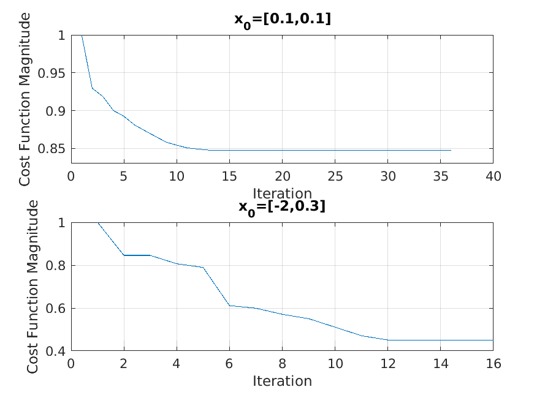

# Numerical Example (Finished)

## 

    mm_multiagent_test.m

1. It draws the magnitude of the **cost function versus iteration** after running the second section of the code.
(Need to load both .mat files.)

* It shows Multi-Agent algorithm converges given a fixed point.

##
    multiagent_YALMIP_NOM_MA_CPR.py

* Generate Table 1. of numerical study:
    infeasibility, voilation rate, and objective function values comparison.

## 

    MM_multiagent_nom_ROI.py

* Generate Region of Attraction regions between NOM and Multi-Agent method:

## Other Files
    mm_multiagent_datacollection.m

* Used for data collection. 
* $Note$: Initial value of Multi-Agent comes from NOM.